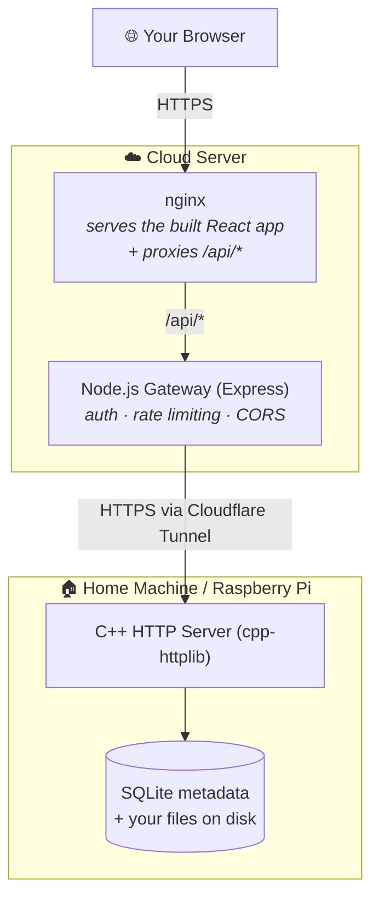

<!-- Replace with the project logo: Frontend/Sorbus/src/assets/sorbus_logo.png -->
<p align="center">
  
</p>

<h1 align="center">Sorbus</h1>

<p align="center">
  <strong>Your files. Your hardware. Your cloud.</strong><br />
  A self-hosted personal cloud storage system you run at home and reach from anywhere.
</p>

<p align="center">
  <!-- License badge -->
  <a href="LICENSE"></a>
  <!-- TODO: Buy Me a Coffee — replace <your-bmc-link> with your real link -->
  <a href="https://www.patreon.com/nour_dev/posts/buy-me-coffee-162723597"></a>
</p>

---

## About Sorbus

Sorbus is a **self-hosted personal cloud storage system** — think of it as your own private Google Drive that runs on hardware you control. You run the storage server and database locally (on a Raspberry Pi or any home server with direct access to your files), and you reach it through a modern web interface hosted online and tunneled back to your home machine.

The philosophy is simple: **you own your data.** Nothing lives on someone else's servers, there's no subscription, and the whole thing runs comfortably on cheap hardware. You decide who gets an account, what they can do, and where the files physically live.

**Author / Credits:** Nour Nada

**Contact:** nour.nada.dev@gmail.com

**Support:** If Sorbus is useful to you, consider supporting development — [Buy Me a Coffee](https://www.patreon.com/nour_dev/posts/buy-me-coffee-162723597)

---

## Table of Contents

- [Features](#features)
- [Screenshots](#screenshots)
- [Architecture at a Glance](#architecture-at-a-glance)
- [Recommended Setup](#recommended-setup)
- [Deployment / Getting Started](#deployment--getting-started)
- [Running the C++ Server](#running-the-c-server)
- [Developer Guide](#developer-guide)
  - [How It All Fits Together](#how-it-all-fits-together)
  - [Authentication Model](#authentication-model)
  - [Project Structure](#project-structure)
  - [Database Schema](#database-schema)
  - [API Reference](#api-reference)
  - [Environment Variables](#environment-variables)
  - [Local Development Setup](#local-development-setup)
  - [Key Behaviors & Gotchas](#key-behaviors--gotchas)
  - [Access Control](#access-control)
  - [Containerization Details](#containerization-details)
- [Security Notes](#security-notes)
- [Contributing](#contributing)
- [Reporting Issues](#reporting-issues)
- [License](#license)
- [Support the Project](#support-the-project)

---

## Features

- 📁 **Three ways to browse** — a nested **tree** view, a **shelf** (grid of cards), and a **ledger** (sortable table)
- ⬆️ **Uploads with live progress** — drag-and-drop, a bottom-right progress toast, no file-size limit at the gateway
- 📂 **Full file management** — create folders, rename, move (with cascade to children), delete, and batch operations
- ⬇️ **Streamed downloads** — files streamed in chunks; folders zipped on the fly
- 👤 **User accounts & roles** — owner / editor / viewer, with a built-in account and admin panel
- 🔐 **Secure by design** — JWT access tokens, refresh cookies, bcrypt password hashing, signed single-use download links
- 🗄️ **Self-contained storage** — SQLite metadata, files stored directly on your chosen disk path
- 🌍 **Reach your whole machine** — the C++ server runs natively, so the owner can re-point storage to *any* folder or drive on the home computer; an optional `FILEAPP_ROOT_LIMIT` confines that to one branch if you'd rather
- 🐳 **Containerized web tier** — the Node gateway + React UI ship as Docker images (the file server runs natively for full filesystem access; an optional container mode exists too)

---

## Screenshots

<!-- TODO: add screenshots or a demo GIF here -->
> _Screenshots / demo GIF coming soon._

---

## Architecture at a Glance

Sorbus is a **three-tier application** that is deliberately **split across two machines**:



| Tier | Tech | Where it runs | Responsibility |
|---|---|---|---|
| **Frontend** | React 19 (built with Vite) | Cloud server | The web UI. In **production**, nginx serves the built static files and proxies `/api/*` to the gateway. During **development**, Vite's dev server serves it instead — nginx is only part of the Docker/production setup. |
| **API Gateway** | Node.js + Express 5 | Cloud server | Auth (JWT + bcrypt), rate limiting, CORS, and proxying requests to the C++ server. |
| **File Server** | C++ (cpp-httplib) + SQLite | Home machine / Pi | All file operations and user management, with direct filesystem access. |

The Node gateway reaches the C++ server over a **Cloudflare tunnel**, so your home machine never needs an open inbound port or a public IP.

---

## Recommended Setup

Sorbus is hardware- and host-agnostic, but if you're starting from scratch, here's what works well.

**🏠 Home tier (file server + database).** Any always-on machine that can hold your files. A **Raspberry Pi 4 or 5** is the sweet spot — inexpensive, low-power, and more than enough for personal use. But you don't need to buy anything: an **old laptop or an unused desktop/PC** makes a great Sorbus host too — it already has a disk, and a laptop even comes with a built-in battery backup. Attach extra storage if you need it and point your starting folder (`FILEAPP_FILE_LOCATION`) at it.

**☁️ Cloud tier (web UI + gateway).** The gateway and frontend are lightweight, so almost any container host works. Crucially, the cloud tier is **stateless** — all your data lives at home on the C++ server — so a host that sleeps when idle loses nothing.

**Recommended: [Render](https://render.com).** It has a genuine free tier (no credit card), builds straight from the Dockerfiles in this repo, and can host React as a free static site. Because the cloud tier is stateless, the free tier's spin-down (a brief cold start after inactivity) costs you nothing but a few seconds — move to an always-on plan (~$7/mo) if you'd rather avoid it.

**Other good options:**
- **[Google Cloud Run](https://cloud.google.com/run)** — the most generous *perpetual* free tier and fast scale-to-zero, if you're comfortable with GCP's heavier setup (billing account, Artifact Registry, the `gcloud` CLI). One caveat for a file app: Cloud Run enforces a per-request timeout (max 60 min), and uploads/downloads stream *through* the gateway — so very large or slow transfers could hit that ceiling. Persistent hosts don't have this limit.
- **[Railway](https://railway.app)** — the smoothest developer experience and no cold starts, but no free tier (~$5/mo minimum, credit card required).

**🔗 Connecting the two — Cloudflare Tunnel.** A Cloudflare Tunnel is how the cloud server reaches the C++ server at home **without exposing your home IP or opening any inbound ports**. Your home machine runs a small `cloudflared` agent that makes an **outbound-only** connection to Cloudflare's edge. You map a hostname (e.g. `cpp.yourdomain.com`) to your local C++ server, and Cloudflare securely routes traffic for that hostname back down the tunnel. That hostname becomes your `C_Server_Route`.

- 📖 [Cloudflare Tunnel — overview](https://developers.cloudflare.com/cloudflare-one/connections/connect-networks/)
- 🚀 [Create your first tunnel (step-by-step)](https://developers.cloudflare.com/cloudflare-one/connections/connect-networks/get-started/create-remote-tunnel/)

> **⚠️ Cloudflare Tunnel upload limit:** Cloudflare's free tier enforces a **100 MB per-request upload cap** at their edge. This is a hard limit — it cannot be worked around server-side, because Cloudflare rejects the request before it reaches your machine. Any single file over 100 MB will fail to upload. Downloads are not affected.

---

## Deployment / Getting Started

This is the **easy path** for getting Sorbus running. Deployment is intentionally scripted.

### Prerequisites

- A **home machine** to hold your files and run the C++ server **natively** (so it can reach your whole filesystem). Needs a C++17 compiler — `g++`/`clang` on Linux/macOS, or Visual Studio / MinGW on Windows. **Docker is not required here.**
- A **cloud server** with **Docker** + Docker Compose to host the web UI + gateway (Node.js + React)
- A **Cloudflare tunnel** pointing at the C++ server on the home machine ([Cloudflare Tunnel docs](https://developers.cloudflare.com/cloudflare-one/connections/connect-networks/))

> **Why native, not a container?** Sorbus is meant to reach *any* folder/drive on your home machine. A container has its own isolated filesystem and can only see what you mount into it, which fights that goal. So the file server runs natively. If you'd rather sandbox it to one folder, an optional container mode lives in [`Docker/optional-local-container/`](Docker/optional-local-container/) — read its README first.

### Step 1 — Generate your config

Clone the repo on the home machine, then run the interactive setup script:

```bash
cd Docker
bash setup.sh
```

`setup.sh` will:
- **Auto-generate** the secrets you should never set by hand: `API_KEY`, `JWT_SECRET`, `REFRESH_TOKEN_SECRET` (via `openssl rand`)
- **Prompt you** for the values only you can decide:

  | Value | What it is |
  |---|---|
  | `FILEAPP_FILE_LOCATION` | The **starting** folder the app opens on. Only a starting point — the owner can re-point storage anywhere allowed. |
  | `FILEAPP_ROOT_LIMIT` | Optional boundary the storage path must stay within. **Leave blank for full filesystem access** (the whole home machine). |
  | `REGISTER_KEY` | The signup key you share with people you want to allow to register |
  | `CORS_ORIGIN` | The exact URL users type in their browser (e.g. `https://sorbus.yourdomain.com`) |
  | `C_Server_Route` | The Cloudflare tunnel URL pointing at the C++ server |

It writes two files: **`.env.local`** (home machine — read directly by the native C++ server) and **`.env.cloud`** (cloud server). Both are git-ignored — never commit them. Copy `.env.cloud` to your cloud server.

> The same `API_KEY` is written to both files (as `FILEAPP_API_KEY` locally, `API_KEY` in the cloud); it's how the Node gateway authenticates to the C++ server, so the two values must match.

### Step 2 — Start the home machine (C++ server, natively)

Build and run the C++ server with the variables from `.env.local` — see [Running the C++ Server](#running-the-c-server) below for the exact per-OS commands.

### Step 3 — Start the cloud tier (Node.js + React)

Pick whichever host you like — the cloud tier is stateless, so nothing here holds your data.

**Any Docker host (VPS, your own server):**

```bash
docker compose -f docker-compose.cloud.yml --env-file .env.cloud up -d
```

**Or one-click to Render** (recommended for most people — see [Recommended Setup](#recommended-setup)):

[](https://render.com/deploy?repo=https://github.com/Nour-Nada/Sorbus&blueprintPath=deploy/render.yaml)

<details>
<summary><strong>Render walkthrough (step by step)</strong></summary>

The button uses a Blueprint that provisions both cloud services for you: the **gateway** (a Docker web service) and the **React frontend** (a free static site). It auto-generates `JWT_SECRET` and `REFRESH_TOKEN_SECRET` — you never touch those.

> **Already ran `setup.sh`?** You don't run it again for Render — the `.env.cloud` it produced is only for the "any Docker host" option above. For Render you enter values in the dashboard instead. The **only** value you carry over is `API_KEY`: use the *same* one that's in your `.env.local`/`.env.cloud` so it matches your home C++ server. The JWT secrets are generated fresh by Render and don't need to match anything, so regenerating them is harmless.

> ⚠️ **Expect a two-step setup:** `CORS_ORIGIN` and `VITE_API_URL` can only be filled in **after** the first deploy (steps 4–5 below), because they're each other's auto-assigned URLs. This is normal — not a mistake.

1. **Click the button** (or in Render: **New → Blueprint**, connect this repo, and set the *Blueprint path* to `deploy/render.yaml`).
2. Render creates **`sorbus-gateway`** and **`sorbus-web`** and prompts you for the two secrets only you know:
   - **`API_KEY`** — the *same* value as `FILEAPP_API_KEY` on your home C++ server.
   - **`C_Server_Route`** — your Cloudflare tunnel URL (the one pointing at the C++ server).
   - Leave `CORS_ORIGIN` and `VITE_API_URL` blank for now.
3. Let it deploy. Render assigns each service a URL, e.g. `https://sorbus-gateway.onrender.com` and `https://sorbus-web.onrender.com`.
4. **Wire the two URLs together** (they can't be known before the services exist):
   - On **`sorbus-gateway`** → Environment → set **`CORS_ORIGIN`** to the **`sorbus-web`** URL.
   - On **`sorbus-web`** → Environment → set **`VITE_API_URL`** to the **`sorbus-gateway`** URL.
5. **Redeploy the frontend** (`sorbus-web` → Manual Deploy). `VITE_API_URL` is baked in at build time, so it needs one rebuild to take effect. The gateway picks up `CORS_ORIGIN` automatically on its next restart.
6. Open the **`sorbus-web`** URL — that's your app. Make sure your home C++ server is running and the tunnel is up, then sign up (first account = owner).

**Free-tier note:** services sleep after ~15 min idle, so the first request after a lull takes ~30–60s to wake. Because the cloud tier is stateless, nothing is lost — upgrade to an always-on instance if the cold start bothers you.

</details>

### Step 4 — First run

1. Open your `CORS_ORIGIN` URL in a browser.
2. Sign up — **the first account automatically becomes the `owner`.** Every account after that starts as a `viewer`.
3. As owner, open the **Account** page and set the **storage path** (this initializes the file index). You can point it at any folder allowed by `FILEAPP_ROOT_LIMIT` — or anywhere on the machine if you left that blank.

You're live.

---

## Running the C++ Server

The file server runs **natively** on the home machine so it has direct, full-speed access to your whole filesystem. It's a single binary built from vendored libraries — no system packages to install beyond a C++17 compiler.

> **One compile note:** `sqlite3.c` and `miniz.c` are **C** files and must be compiled with a **C** compiler (`gcc`/`clang`). Compiling them with `g++` fails, because C++ forbids the implicit `void*` conversions SQLite relies on. The commands below do this correctly.

### Linux / macOS

```bash
cd C++_Server

# 1. Compile the C libraries with a C compiler
gcc -O2 -I header_libs/sqlite3 -c header_libs/sqlite3/sqlite3.c -o sqlite3.o
gcc -O2 -c header_libs/miniz/miniz.c -o miniz.o

# 2. Compile + link the server (C++)
g++ -std=c++17 -O2 -I header_libs/sqlite3 -I header_libs \
  server.cpp header_libs/src_sqlite/*.cpp sqlite3.o miniz.o \
  -lpthread -ldl -lm -o sorbus-server

# 3. Load the generated env vars and run (from wherever your .env.local is)
set -a; . ../Docker/.env.local; set +a
./sorbus-server
```

On macOS use the same commands (Apple Clang provides `gcc`/`g++`); drop `-ldl` if your linker complains (it's a no-op on macOS).

To keep it running across reboots, wrap it in a **systemd** service (Linux) or a **launchd** plist (macOS).

> _These commands are AI-generated and have not been personally tested by the author — they may need small tweaks for your specific setup._

### Windows

**Build:** open `C++_Server/C++_Server_VS.sln` in **Visual Studio** and build (x64, Release). That produces `sorbus-server.exe` under `x64/Release/`. Windows may block locally-built binaries — see the Smart App Control note below.

> **⚠️ Smart App Control:** Windows may block the compiled binary because it is unsigned — locally-built executables have no code-signing certificate, so Windows cannot verify their publisher. If this happens, you have a few options:
>
> - **WSL2** — Install Ubuntu from the Microsoft Store and build/run the server inside WSL2 using the Linux commands above. SAC does not apply to WSL2 processes, so this sidesteps the problem entirely.
> - **Developer Mode** — Go to *Settings → System → For Developers* and enable Developer Mode. This allows unsigned local binaries to run without touching SAC itself (although this dosn't always work).
> - **Disable Smart App Control** — *Settings → Windows Security → App & Browser Control → Smart App Control → Off*. ⚠️ **Warning: this is permanent.** Once SAC is disabled it cannot be re-enabled — you would need to reinstall Windows to get it back. Only do this if you fully accept that trade-off.

Alternatively build with **MinGW-w64** using the same two-step `gcc`/`g++` commands as above (omit `-ldl`), though that binary will have the same signing issue.

**Run** from PowerShell, loading `.env.local` into the environment first:

```powershell
Get-Content ..\Docker\.env.local | Where-Object { $_ -and $_ -notmatch '^\s*#' } | ForEach-Object {
  $name, $value = $_ -split '=', 2
  Set-Item "Env:$name" $value.Trim()
}
.\sorbus-server.exe
```

Use forward slashes in `FILEAPP_FILE_LOCATION` / `FILEAPP_ROOT_LIMIT` (e.g. `C:/Users/you/Documents`). To run on boot, register it as a scheduled task (**Task Scheduler** → "At log on / At startup").

> _These commands are AI-generated and have not been personally tested by the author — they may need small tweaks for your specific setup._

### What `FILEAPP_ROOT_LIMIT` does

- **Blank (default):** no boundary — the owner can set the storage path to **any** folder or drive the server can reach. This is the "access my whole computer from anywhere" mode.
- **Set to a path:** the storage path can only be set **inside** that folder. Attempts to point outside it are rejected with a clear *"outside the allowed root"* message in the UI (not a generic error).

`FILEAPP_FILE_LOCATION` is only the **starting** folder — never a fence. The fence is `FILEAPP_ROOT_LIMIT`.

---

## Developer Guide

> **Goal:** clone the repo and be productive in ~30 minutes. This section is the map.

### How It All Fits Together

A request flows through all three tiers:

```
Browser (React) ──► nginx (/api proxy) ──► Node.js gateway ──► C++ server ──► SQLite / disk
```

- **React** never talks to the C++ server directly. It only knows about `/api/*`, which nginx proxies to Node.
- **Node.js** is the security boundary. It verifies JWTs, hashes passwords, enforces rate limits, and only then proxies the request to the C++ server — adding the shared `key` header.
- **C++** trusts any request carrying the correct `key` header. It does the actual filesystem and database work. It has **no concept of JWTs** — auth is entirely Node's job; the C++ layer is protected by being unreachable except through the tunnel + shared key.

### Authentication Model

| Mechanism | Where | Details |
|---|---|---|
| **Access token (JWT)** | Node ⇄ Browser | 5-minute lifetime, signed with `JWT_SECRET`, payload is just `{ userId }`. Sent as `Authorization: Bearer <token>`. |
| **Refresh token** | Node ⇄ Browser | 7-day `httpOnly` cookie, signed with `REFRESH_TOKEN_SECRET`, payload `{ userId, username, access }`. Used to mint new access tokens. |
| **Password hashing** | Node | `bcrypt`. The C++ server only ever stores/compares the hash — **plaintext passwords never reach C++.** |
| **Signed download links** | Node | 60-second, single-use tokens (`crypto.randomBytes`) kept in an in-memory map, so the browser can download via a native `<a>` tag without a JWT header. |
| **Shared API key** | Node ⇄ C++ | Every request from Node to C++ carries a `key` header matching `FILEAPP_API_KEY`. |

### Project Structure

```
C++_Server/
  server.cpp                  — entire C++ server (single file)
  sorbus.db                   — SQLite database (ships with example test users)
  header_libs/                — vendored header-only / compiled libs
    httplib.h                 — cpp-httplib (HTTP server)
    json.hpp                  — nlohmann/json
    SQLiteCpp/ + src_sqlite/  — SQLiteCpp wrapper (headers + compiled .cpp)
    sqlite3/                  — SQLite3 amalgamation
    miniz/                    — miniz (ZIP for folder downloads)

Node_Backend/
  index.js                    — entire Node.js gateway (single file)
  package.json

Frontend/Sorbus/src/
  main.jsx                    — axios baseURL setup
  App.jsx                     — provider tree, JWT interceptors, routes
  context/                    — Auth, Account, and File React contexts
  pages/                      — Landing, Login, Signup, Home, Account, etc.
  components/                 — SideBar, FileView, ShelfView, LedgerView, etc.

Docker/
  docker-compose.cloud.yml    — Node.js + React (cloud server)
  Dockerfile.node / .react
  nginx.conf.template         — ${NODE_BACKEND_URL} substituted at startup
  setup.sh                    — generates .env.local + .env.cloud
  .env.local.example / .env.cloud.example
  optional-local-container/   — OPTIONAL containerized C++ server (read its README first)
    Dockerfile.cpp · docker-compose.local.yml · README.md · .env.example
```

### Database Schema

SQLite in **WAL mode**. Three tables:

```sql
users       — id, username, email, password (bcrypt hash), access ('owner'|'editor'|'viewer'), created_at
files       — id, user_id, file_name, file_location, file_size, file_extension, uploaded_at
server_info — singleton row (id=1): server_status, register_key, file_location
```

- **First signup → `owner`.** Everyone after → `viewer`.
- **Folders** are rows with `file_size = -1` and `file_extension = 'folder'`.
- `file_location` is the path relative to the storage root, `/`-separated; an empty string means the root.
- `FOREIGN KEY(user_id) REFERENCES users(id) ON DELETE CASCADE` — deleting a user removes their file rows.

### API Reference

All C++ routes require a `key` header matching `FILEAPP_API_KEY`. The Node gateway adds this automatically.

<details>
<summary><strong>C++ Server routes</strong></summary>

**User**

| Method | Path | Description |
|---|---|---|
| POST | `/api/user/signup` | First user → owner. Returns `{user_id, username, access}`. |
| GET | `/api/user/login/:username` | Matches username or email. Returns the password hash for Node to compare. |
| GET | `/api/user/name` | All users keyed by username. |
| PATCH | `/api/user/change/access/:uid_main/:uid_change/:access` | Owner-only. `:access` ∈ {editor, viewer}. |
| DELETE | `/api/user/delete/:uid_main/:uid_change` | Owner-only. Cascades to files. |

**Files**

| Method | Path | Description |
|---|---|---|
| GET | `/api/files/name/:user_id` | Returns `{ tree, fileIds, fileInfo, initialized }`. |
| GET | `/api/files/download/:file_id/:user_id` | Streams file in 64KB chunks; folders zipped via miniz. Editor+. |
| GET | `/api/files/storage` | Free bytes on the storage partition. |
| GET | `/api/files/filesizes` | `SUM(file_size)` across all files. |
| POST | `/api/files/upload/:user_id` | Raw body upload. Editor+. |
| POST | `/api/files/create/:user_id` | Create a folder. Editor+. |
| PATCH | `/api/files/name/:file_id/:user_id` | Rename (cascades to children for folders). Editor+. |
| PATCH | `/api/files/move/:file_id/:user_id` | Move (cascades). Editor+. |
| DELETE | `/api/files/delete/:file_id/:user_id` | Delete (cascades DB + filesystem). Editor+. |

**Features**

| Method | Path | Description |
|---|---|---|
| GET | `/api/features/location` | Current storage path. |
| PATCH | `/api/features/location/:user_id` | Owner-only. Sets storage path, re-indexes files. |
| PATCH | `/api/features/reinitialize/:user_id` | Owner-only. Re-scans the storage directory. |

</details>

<details>
<summary><strong>Node.js Gateway routes</strong></summary>

| Route | Middleware | Notes |
|---|---|---|
| `GET /` | limiter | Health check. |
| `POST /api/user/refresh` | limiter | Reads refresh cookie, returns a new access token. |
| `POST /api/user/logout` | limiter | Clears the refresh cookie. |
| `GET /api/user/verify` | limiter, verifyJWT | 200 if token valid. |
| `POST /api/user/signup` | limiter | Validates input, bcrypt-hashes, proxies to C++. |
| `POST /api/user/login/:username` | limiter | Fetches hash, bcrypt-compares, issues tokens. |
| `GET /api/user/name` | limiter, verifyJWT | |
| `PATCH /api/user/change/access/...` | limiter, verifyJWT, verifyUserId | |
| `DELETE /api/user/delete/...` | limiter, verifyJWT, verifyUserId | |
| `GET /api/files/name/:user_id` | limiter, verifyJWT, verifyUserId | |
| `GET /api/files/download/:file_id/:user_id` | limiter, verifyJWT, verifyUserId | JWT-protected direct stream. |
| `GET /api/files/download-token/:file_id/:user_id` | limiter, verifyJWT, verifyUserId | Issues a 60s single-use token. |
| `GET /api/files/download-stream/:file_id/:user_id?token=` | downloadLimiter | No JWT — token is the gate. Enables native `<a>` downloads. |
| `GET /api/files/storage` · `GET /api/files/filesizes` | limiter, verifyJWT | |
| `POST /api/files/upload/:user_id` | limiter, verifyJWT, verifyUserId | No size limit. |
| `POST /api/files/create/...` · `PATCH name/move` · `DELETE delete` | limiter, verifyJWT, verifyUserId | |
| `GET /api/features/location` | limiter, verifyJWT | |
| `PATCH /api/features/location/:user_id` · `reinitialize/:user_id` | verifyJWT, verifyUserId, limiter | |

**Rate limits:** `limiter` = 100 req / 5 min / IP (standard routes); `downloadLimiter` = 60 req / 5 min / IP (download-stream only).

</details>

### Environment Variables

<details>
<summary><strong>C++ Server</strong></summary>

| Variable | Required | Default | Description |
|---|---|---|---|
| `FILEAPP_API_KEY` | No | `test12345` | Shared secret checked on every request. Set a real one (setup.sh does). |
| `FILEAPP_REGISTER_KEY` | **Yes** | — | Signup key written to the DB on startup. Server exits if not set. |
| `FILEAPP_FILE_LOCATION` | No | `""` | **Starting** folder shown on first load. Not a boundary — the owner can re-point storage from the Account page. |
| `FILEAPP_ROOT_LIMIT` | No | `""` | Boundary the storage path must stay within. **Empty = no limit** (full filesystem access). |
| `FILEAPP_DB_PATH` | No | `sorbus.db` | Path to the SQLite file. |
| `FILEAPP_MAX_FILES` | No | `5000000` | Max files before uploads return 507. |

</details>

<details>
<summary><strong>Node.js Gateway</strong></summary>

| Variable | Required | Description |
|---|---|---|
| `API_KEY` | Yes | Sent as `key` to the C++ server. Must match `FILEAPP_API_KEY`. |
| `C_Server_Route` | Yes | Base URL of the C++ server (the tunnel URL). |
| `JWT_SECRET` | Yes | Signs 5-minute access tokens. |
| `REFRESH_TOKEN_SECRET` | Yes | Signs 7-day refresh cookies. |
| `CORS_ORIGIN` | Yes | Exact allowed browser origin (no trailing slash). |
| `PORT` | No | Listen port (default `3000`). |

</details>

<details>
<summary><strong>React Frontend</strong></summary>

| Variable | Required | Description |
|---|---|---|
| `VITE_API_URL` | No | axios base URL. Defaults to same-origin (`''`). Leave empty in Docker — nginx proxies `/api/*`. Set only if React and Node are on different domains. |

</details>

### Local Development Setup

Run each tier directly (outside Docker) for fast iteration.

**1. C++ server** — compile with the vendored libraries and run:

```bash
cd C++_Server
# Compile the C libraries with gcc, then the C++ server with g++ (see "Running the C++ Server" for why)
gcc -O2 -I header_libs/sqlite3 -c header_libs/sqlite3/sqlite3.c -o sqlite3.o
gcc -O2 -c header_libs/miniz/miniz.c -o miniz.o
g++ -std=c++17 -O2 -I header_libs/sqlite3 -I header_libs \
  server.cpp header_libs/src_sqlite/*.cpp sqlite3.o miniz.o \
  -lpthread -ldl -lm -o sorbus-server

FILEAPP_REGISTER_KEY=dev-register-key ./sorbus-server
```

> `FILEAPP_REGISTER_KEY` is mandatory — the server exits immediately without it. On Windows, build in Visual Studio (Smart App Control may block locally-built binaries — see the Windows section above).

> _These commands are AI-generated and have not been personally tested by the author — they may need small tweaks for your specific setup._

**2. Node.js gateway:**

```bash
cd Node_Backend
npm install
# create a .env with API_KEY, C_Server_Route, JWT_SECRET, REFRESH_TOKEN_SECRET, CORS_ORIGIN
npm start          # nodemon index.js
```

**3. React frontend:**

```bash
cd Frontend/Sorbus
npm install
npm run dev        # Vite dev server; proxies /api to VITE_API_URL or http://localhost:3000
```

### Key Behaviors & Gotchas

These will save you debugging time:

- **C++ logs go to `server_output.txt`.** At startup the server redirects `std::cout` to `server_output.txt` (append mode), so the terminal appears silent — this is normal. Check that file for route logs. `std::cerr` (startup warnings) still goes to the terminal.
- **Don't change two error strings.** Node returns `"Invalid JWT token."` (401) and `"Access denied: user ID mismatch."` (403). The frontend matches these *exact* strings to trigger logout / redirect. Changing them silently breaks auth UX.
- **Thread-safe storage path.** `FILE_LOCATION` in C++ is guarded by a `shared_mutex` — always use `get_file_location()` / `set_file_location()`, never read it directly.
- **Per-request DB connections.** Every C++ route opens its own connection via `openDB()` (with a 5s busy timeout). Never share a `SQLite::Database` across threads.
- **`storageReady` flag.** When the C++ server reports `initialized: false` (no storage path set), the UI shows a "configure storage" message instead of the file grid. It briefly flashes the grid on first load — a known cosmetic issue.
- **Provider order matters.** In `App.jsx` it must be `AccountProvider > AuthProvider > FileProvider` because `AuthProvider` reads from `AccountProvider`.
- **Module-level access token.** The axios interceptor reads the token from a module-level variable (`getAccessToken()`), not React state, to avoid stale closures.

### Access Control

| Role | Capabilities |
|---|---|
| `owner` | Everything — set storage path, re-scan, manage users (roles & deletion), plus all editor actions. |
| `editor` | Upload, create folders, download, rename, move, delete. |
| `viewer` | Browse the file tree and metadata only — no downloads or modifications. |

The **first signup becomes owner**; everyone else starts as a viewer. The owner promotes users manually. The owner role **cannot** be assigned through the change-access API.

### Containerization Details

The **cloud tier** is containerized (this is the recommended deployment for it):

| Image | Base | Notes |
|---|---|---|
| `Dockerfile.node` | `node:lts-alpine` | `npm ci --omit=dev`, runs `node index.js` directly. |
| `Dockerfile.react` | `node:lts-alpine` → `nginx:alpine` | Multi-stage: `vite build`, then nginx serves `dist/`. |

- **nginx** proxies `/api/*` to the Node container. The `nginx.conf.template` uses `${NODE_BACKEND_URL}`, which nginx substitutes at container startup (the template lives in `/etc/nginx/templates/`).
- `client_max_body_size 0` + `proxy_request_buffering off` allow large, unbuffered file streaming.

The **C++ server is not containerized by default** (it runs natively for full filesystem access). An optional container image — `gcc:14` → `debian:trixie-slim`, multi-stage so only the binary ships — lives in [`Docker/optional-local-container/`](Docker/optional-local-container/); it jails the server to one bind-mounted `/storage` folder and persists the DB on a named volume. Read that folder's README for the trade-offs before using it.

---

## Security Notes

**In plain terms (worth reading even if you're not technical):** Sorbus is *your* private cloud, which means **you** are the administrator and the security is in your hands. A few things to understand:

- **Your account password is the key to everything.** If someone gets the password to an `owner` or `editor` account, they can browse, download, change, or delete your files — and an `owner` can also re-point the storage location and manage other users. Use a **strong, unique password**, and don't reuse it from other sites.
- **By default the server can reach your *entire* filesystem.** This is the intended feature — remote access to any folder/drive on your home machine — but it means an `owner` account compromise exposes your whole disk. Decide deliberately: leave `FILEAPP_ROOT_LIMIT` **blank** only if you genuinely want full-machine access; otherwise **set it** to confine access to one branch (e.g. a dedicated `~/sorbus-shared` folder), so even a worst case is limited to that subtree. `FILEAPP_FILE_LOCATION` is only the starting folder — it does **not** limit anything.
- **Anyone with your `REGISTER_KEY` can make an account.** Treat it like a password and share it only with people you trust.
- **Keep your host machine updated and patched.** Self-hosting means the operating system, Docker, and your Cloudflare tunnel are your responsibility to keep current.

And the operational rules:

- **Never expose the C++ server's port directly to the internet.** The C++ server has *no per-user authentication of its own* — it trusts any request carrying the correct `key` header. Its protection is being reachable **only** through the Cloudflare tunnel + that shared key. Keep its port firewalled and let the tunnel be the only way in.
- **Always let `setup.sh` generate your secrets.** It creates strong random values for `API_KEY`, `JWT_SECRET`, and `REFRESH_TOKEN_SECRET`. There is no default key anywhere — an empty value is rejected at startup — so you can't accidentally run with a weak placeholder. Never reuse the same value for the two JWT secrets.
- **Set a strong `REGISTER_KEY`.** It's the only thing stopping strangers from creating accounts. Share it only with people you want to have access.
- **Keep `.env.local` and `.env.cloud` out of version control.** They hold your secrets and are git-ignored by default — keep them that way.
- **Serve everything over HTTPS.** Refresh-token cookies are marked `Secure` in production; the Cloudflare tunnel and your cloud host should both terminate TLS.

## Contributing

Contributions are welcome! Please read [CONTRIBUTING.md](CONTRIBUTING.md) for how to fork, branch, and open a pull request. A quick note on code style for the C++ and Node files: **every function gets a one-line comment** describing what it does, and multi-line comment blocks are avoided.

## Reporting Issues

Found a bug? Open a [GitHub issue](../../issues/new/choose) using the bug report template. Include what you were doing, what you expected, what happened, and any relevant logs (the C++ server writes route logs to `server_output.txt`).

For questions, ideas, or general discussion, open a GitHub issue — all communication goes through GitHub.

## License

Released under the [MIT License](LICENSE). © Nour Nada.

## Support Me

If Sorbus saves you a subscription or just makes your life easier, consider supporting me:

☕ [Buy Me a Coffee](https://www.patreon.com/nour_dev/posts/buy-me-coffee-162723597)
